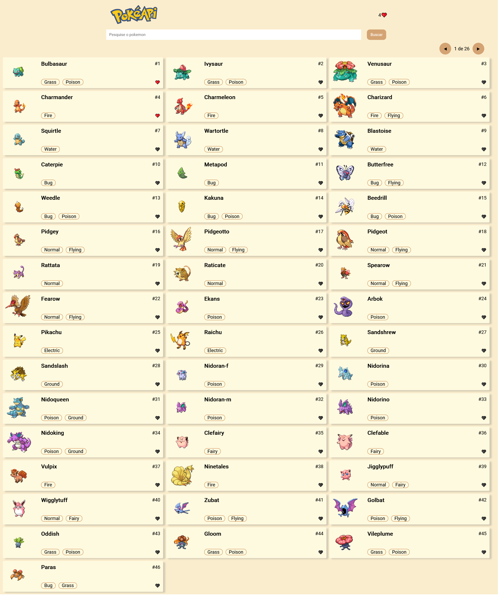
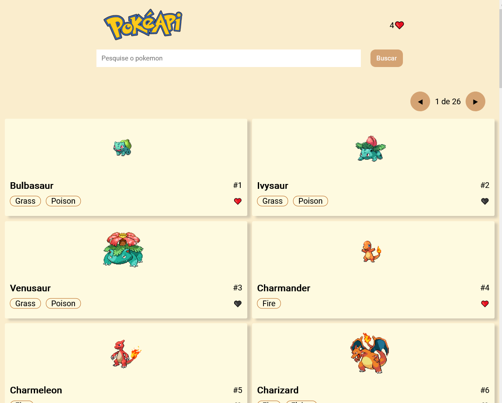
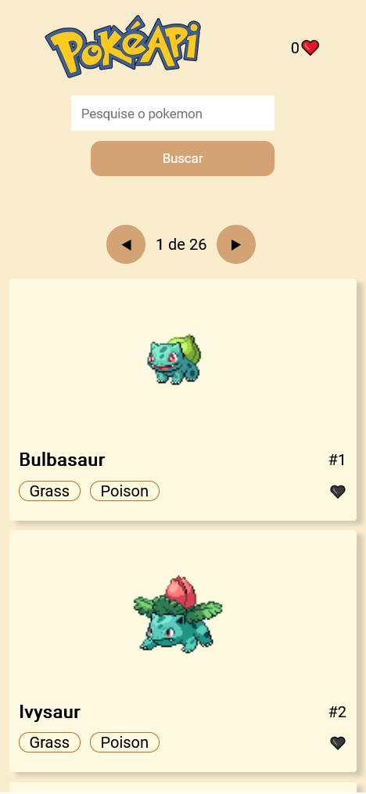

# <div align="center"> Pokedex React App</div>
<a href="https://pokedex-react-three.vercel.app">
</a>
<a href="https://pokedex-react-three.vercel.app/">
</a>
<a href="https://pokedex-react-three.vercel.app/">
</a>
<p align="center">A Responsive Pokedex made with React JS, Hooks,  consuming the pokeapi and using localstorage.</p>

## 🛠️ Technologies

<ul>
  <li><a href="https://reactjs.org/">React</a></li>
  <li><a href="https://pokeapi.co/">Poke Api</a></li>
</ul>

## ⚙️ Requirements

<ul>
  <li><a href="https://git-scm.com/">Git</a></li>
  <li><a href="https://nodejs.org/en/">Node.js</a></li>
  <li><a href="https://www.npmjs.com/">NPM</a></li>
  <li><a href="https://vitejs.dev/guide/">VITE</a></li>
</ul>

## 🚀 Installation

```
$ git clone https://github.com/Hudson3384/pokedexReact.git

```

## Author

 [<br><sub>Hudson Arruda Ribeiro</sub>](https://github.com/hudson3384) 
